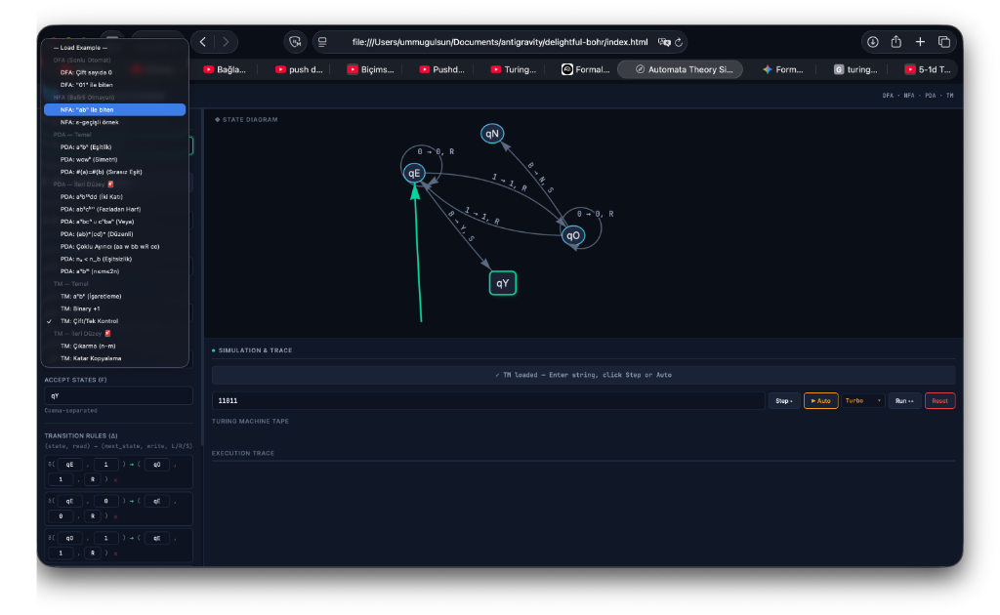
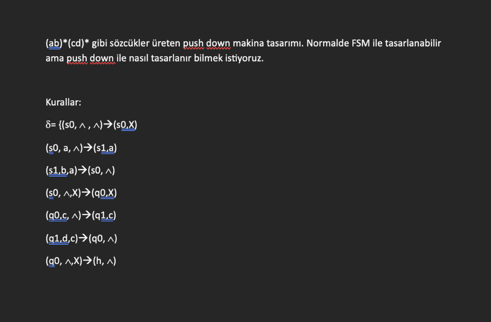

# Automata Theory Simulator 🚀

[](https://html.spec.whatwg.org/)
[](https://developer.mozilla.org/en-US/docs/Web/JavaScript)
[](https://www.w3.org/Style/CSS/)
[](https://opensource.org/licenses/MIT)

A comprehensive, interactive web-based simulator for **Automata Theory and Formal Languages**. Built as a high-performance Single-Page Application (SPA) with no external framework dependencies, this tool visualizes and simulates the core computational models dynamically.

## 📸 Screenshots

| Main Simulation Workspace | Trace Engine & Simulation Steps |
| --- | --- |
|  |  |

---

## 🌟 Key Features

* **All-in-One Engine:** Define states ($Q$), input alphabet ($\Sigma$), stack alphabet ($\Gamma$), start state ($q_0$), accept states ($F$), and custom transition rules ($\delta$) for **4 different machine types**:
  * **DFA** (Deterministic Finite Automaton)
  * **NFA** (Nondeterministic Finite Automaton) - *Supports $\epsilon$-transitions.*
  * **PDA** (Pushdown Automaton) - *Fully supports stack operations.*
  * **TM** (Turing Machine) - *Includes an infinite interactive tape.*
* **Interactive Graph Visualization:** Visualizes nodes and transition edges using `vis-network` with a custom-tuned `barnesHut` physics solver and overlap avoidance algorithms for stable, fluid node physics.
* **Step-by-Step Execution Trace:**
  * **DFA/NFA:** Highlights active states and paths.
  * **PDA:** Visualizes stack operations (Push/Pop) frame-by-frame.
  * **TM:** Displays a fully interactive tape with Read/Write head movements.
* **Modern Developer-Tool UI/UX:** Sleek glassmorphism aesthetic, dark mode, neon state indicators, code-editor style transition rules, and a **Quick Load** header panel.

---

## 🎓 Academic Example Library

The simulator comes pre-loaded with **over 40+ presets** inspired by midterm, final, and quiz questions of academic curricula (specifically curated around common university problem sets):

* **DFA & NFA:** $0^*1^*$, ending with `01`, containing `abb` or `aab`, sonu `00` veya `11` ile biten, first equals last.
* **PDA:** $a^n b^n$, $w c w^R$ (palindromes), $a^k b^{2k} dd$ (double match), $a^i b^{i+j} c^j$ (composite stack match), balanced parentheses.
* **Turing Machine:** Binary Incrementer ($x+1$), subtraction ($n - m$), copying strings ($w \to ww$), reversing strings ($w \to w^R$), symbol replacement ($c \to d$).

---

## 🛠️ Getting Started

### Local Setup
Since this project is built entirely on native web APIs, **no build step is required**. You can open it directly in a browser or host it locally:

1. **Clone the repository:**
   ```bash
   git clone https://github.com/ummugulsunn/automata-theory-simulator.git
   cd automata-theory-simulator
   ```

2. **Serve the app:**
   You can simply open `index.html` in any browser. For the best local experience (handling assets, testing, etc.), you can run a lightweight server:
   
   Using Python:
   ```bash
   python3 -m http.server 8080
   ```
   
   Using Node.js:
   ```bash
   npx http-server -p 8080 .
   ```

3. Open `http://localhost:8080` in your web browser.

---

## 🤝 Contributing & Academic Use

This project was built to assist students studying **Automata Theory & Formal Languages**. Feel free to fork, open issues, or request additions of new transition presets representing classic university exam questions.

## 📄 License
This project is licensed under the MIT License. See [LICENSE](LICENSE) for details.
